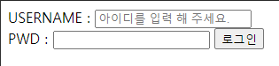

# Today I learned


##### 1. CSS 기본 박스 모델

문서의 레이아웃을 계산할 때, 브라우저의 렌더링 엔진은 표준 CSS 기본 박스 모델에 따라 각각의 요소를 사각형으로 표현한다. CSS는 박스의 크기, 위치, 속성을 결정한다.


하나의 박스는 네 부분으로 이루어져있다. 

- content
- padding
- border
- margin


**content area**

콘텐츠 경계가 감싼 영역으로, 글이나 이미지, 비디오 등의 요소의 실제 내용을 포함한다. 콘텐츠 영역의 크기는 콘텐츠 너비와 콘텐츠 높이이다. 배경색, 배경이미지를 포함할 수 있다.

`box-sizing` 의 속성값이 기본값인 content-box이고,

```html
.content {
	box-sizing : content-box;
}
```

요소가 블록 레벨 요소인 경우, `width`, `height`등으로 명시적으로 설정할 수 있다.

이 때, `box-sizing`은 기본 css 박스 크기 결정법을 사용한다. 

content-box 는 테두리와 안쪽 여백을 더하고, border-box는 테두리와 안쪽 여백의 크기도 요소의 크기로 고려한다.


**padding area**

안쪽 여백 영역은 안쪽 여백 경계가 감싼 영역으로, 콘텐츠 영역을 요소의 안쪽까지 포함하는 크기로 확장한다. 영역의 크기는 안쪽 여백 박스 너비와 안쪽 여백 박스 높이이다. 두께는 `padding-top`과 같은 속성으로 결정할 수 있다.


**border area**

테두리 영역은 테두리 경계가 감싼 영역으로, 안쪽 여백 영역을 요소의 테두리까지 포함하는 크기로 확장한다. 영역의 크기는 테두리 박스 너비와 테두리 박스 높이이다.


**margin area**

바깥 여백 영역은 바깥 여백 경계가 감싼 영역으로, 테두리 요소를 확장해 요소와 인근 요소 사이의 빈 공간까지 포함하도록 만든다.


##### 2. html form, input

```html
  <form action="">
    <div>
      <label for="username">USERNAME :
        <input type="text" id="username" name="username" placeholder="아이디를 입력하세요.">
      </label>
    </div>
    <div>
      <label for="pwd">PWD :
        <input type="password" name="pwd" id="pwd"> <input type="submit" value="로그인">
      </label>
    </div>
  </form>
```

위와 같은 방법으로 



를 구축할 수 있다. 여기서 `form`은 사용자의 input을 받아 저장하는 역할을 수행한다.