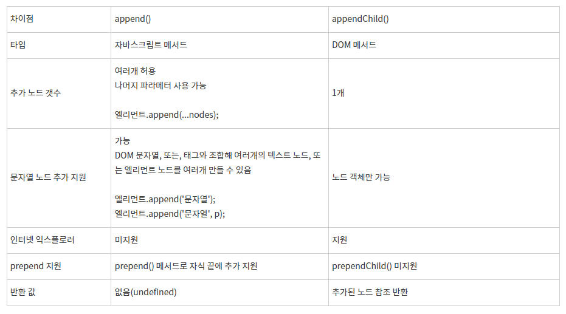

# Javascript (with node)

### 동기적 함수, 비동기적 함수, 콜백 함수

- 동기적 함수

```python
print(1)
print(2)
print(3)
```

이와 같은 `python` 함수를 실행시킬 때, 1,2,3 순서대로 실행되는 것이 동기적 함수입니다.

즉, 코드가 위에서 아래로 내려오며 실행되는 처리를 동기적 처리라고 합니다.

- 비동기적 함수

```javascript
console.log('1')
setTimeout(() => {
    console.log('2')
}) // default = 0
console.log('3')
```

이와 같은 `javascript`코드를 실행할 때, 1,2,3 순서대로 처리될 것이라 예상했지**만** 그렇지 않습니다. :smile_cat: 

javascript는 싱글 스레드이기 때문에 비동기적 언어이고, 이를 위한 call stack, event loop, callback queue를 사용합니다.

#### 이게 뭐냐면,,!!

코드를 읽는 과정에서 즉시 완료될 수 있는 것은 call stack에 담아 이를 바로 실행합니다. **그러나** 그렇지 않다고 판단되는 코드는 event loop에 넘겨 이를 수행합니다. web api라고도 하는데, 이는 그 일을 대신 처리해 주도록 하는 다른 프로세스를 말한다고 생각합니다.

물론 node는 web browser가 아니기 때문에 node만의 event loop를 처리하는 곳이 있겠죠.

반면에,

```python
import time
def sleep1sec():
    time.sleep(1)
    print(2)
    return
print(1)
sleep1sec()
print(3)
```

이와 같은 코드는 1,2,3 순서대로 나옵니다(python). 이는 파이썬이 비동기적 언어가 아니기 때문입니다.


여기서, non-blocking과 async의 유사한 부분 때문에, 이를 같은 개념으로 혼용할 수 있음에 주의해야 합니다.

참고 : [TIL network](https://github.com/Mingdoo/TIL/blob/master/1018/network.md)


## append와 appendChild의 차이



위의 표와 같이, append()는 문자열 자체를 추가할 수 있습니다.(`개꿀`) 즉, 코드의 작성량을 줄일 수 있습니다.

예를 들어, appendChild()를 사용하여 `li` tag를 만들려고 하면,

```javascript
const li = document.createElement('li')
const litext = document.createTextNode('test')
li.appendChild(litext)
const ul = document.querySelector('ul')
ul.appendChild(li)
```

위처럼 사용해야 하지만, append()를 사용하면

```javascript
const li = document.createElement('li')
li.append('test2')
const ul = document.querySelector('ul')
ul.append(li)
```

로 이를 표현할 수 있다.

