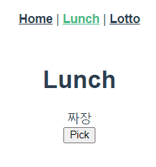
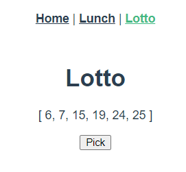

# Workshop

- Lunch

```html
<template>
  <div>
    <h1>Lunch</h1>
    <div>{{ lunch }}</div>
    <button @click="selectLunch">Pick</button>
  </div>
</template>

<script>
import _ from 'lodash'

export default {
  name: "Lunch",
  data: function () {
    return {
      lunch: null,
    }
  },
  methods: {
    selectLunch: function () {
      const lunches = ['짜장', '짬뽕', '볶음밥']
      this.lunch = _.sample(lunches)
    }
  }
}
</script>
```



- Lotto

```html
<template>
  <div>
    <h1>Lotto</h1>
    <p>{{ picked }}</p>
    <button @click="pickNumbers">Pick</button>
  </div>
</template>

<script>
import _ from 'lodash'
export default {
  name: "Lotto",
  data: function () {
    return {
      numbers: _.range(1,46),
      picked: null
    }
  },
  methods: {
    pickNumbers: function () {
      this.picked = _.sortBy(_.sampleSize(this.numbers, 6))
    }
  }
}
</script>
```

