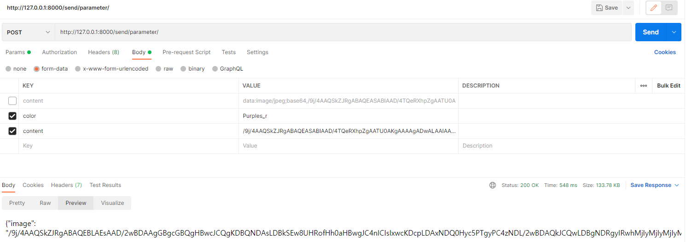

# Today I learned


django 서버에 base64로 요청 보내기




```python
from django.views.decorators.csrf import csrf_exempt

class SendView(View):
    @csrf_exempt
    def post(request):
        if request.method == 'POST':
            # json 형식 받기
            data = request.POST

            #json 형식 배열로 각 변수에 저장
            color_raw = data.get("color")
            image_dec = base64.b64decode(data.get('content'))

            image = 'userinput.jpg'
            
            with open(image, 'wb') as f:
                f.write(image_dec)
            
            fusion_image = nails.makeNail(image, color_raw)[0]
            fusion_image = './results/' + fusion_image
            print(fusion_image)
            with open(fusion_image, 'rb') as f:
                image_enc = base64.b64encode(f.read())
            # json 형식으로 return  
              
            send_data = {
                "image" : image_enc.decode('utf-8')
            }
            
            return JsonResponse(send_data)
```


이미지로 받고 이미지로 전송하는 방법! 오늘도 하나 배웠당 :smile:

