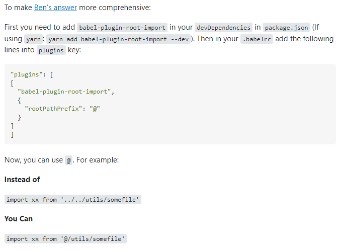

# React custom hooks

#### 사용하는 이유

> 재사용 되는 로직을 커스텀 훅으로 관리한다.

#### 사용하는 방식

```react
import { useState, useCallback } from 'react';

function useInputs(initialForm) {
  const [form, setForm] = useState(initialForm);
  // change
  const onChange = useCallback(e => {
    const { name, value } = e.target;
    setForm(form => ({ ...form, [name]: value }));
  }, []);
  const reset = useCallback(() => setForm(initialForm), [initialForm]);
  return [form, onChange, reset];
}

export default useInputs;
```

이렇게 생성한 커스텀 훅을

```react
const input = useInputs('')
```

로 정의한 후,

```react
<input {...input}/>
```

과 같이 사용할 수 있다.

##### 다만!

위처럼 spread로 작성하는 것이 일반적으로 권장되는 방식은 아니다. 이를 해결하기 위해 array 구조분해 할당을 통해

```react
const [form, onChange, reset] = useInputs('')
```

그리고

```react
<input form={form} onChange={onChange} reset={reset}/>
```

로 사용할 수 있다.


커스텀 훅을 사용할 때,

```react
function MainPage() {
    const [username, setUsername] = useState('');
    const handleUsername = (e) => setUsername(e.target.value);
    const [password, setPassword] = useState('');
    const handlePassword = (e) => setPassword(e.target.value);
    const [email, setEmail] = useState('');
    const handleEmail = (e) => setEmail(e.target.value);
    
    return (
    	//...JSX logic
    )
}

export default MainPage;
```

위와 같은 코드가

```react
function MainPage() {
    const username = useInput();
    const password = useInput();
    const email = useInput();

    return (
    	//...JSX logic
    )
}

export default MainPage;
```

가 된다는 마법..!!


# jsconfig.json



캬.. 이건 진짜 지린당..